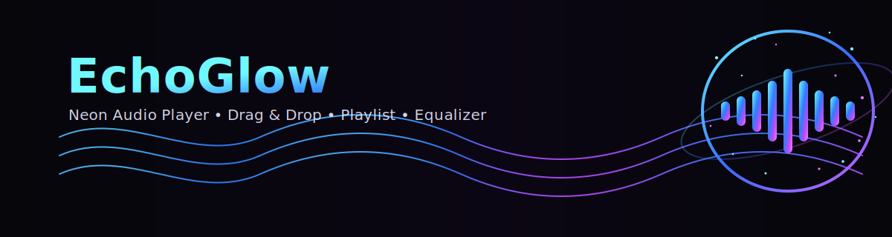
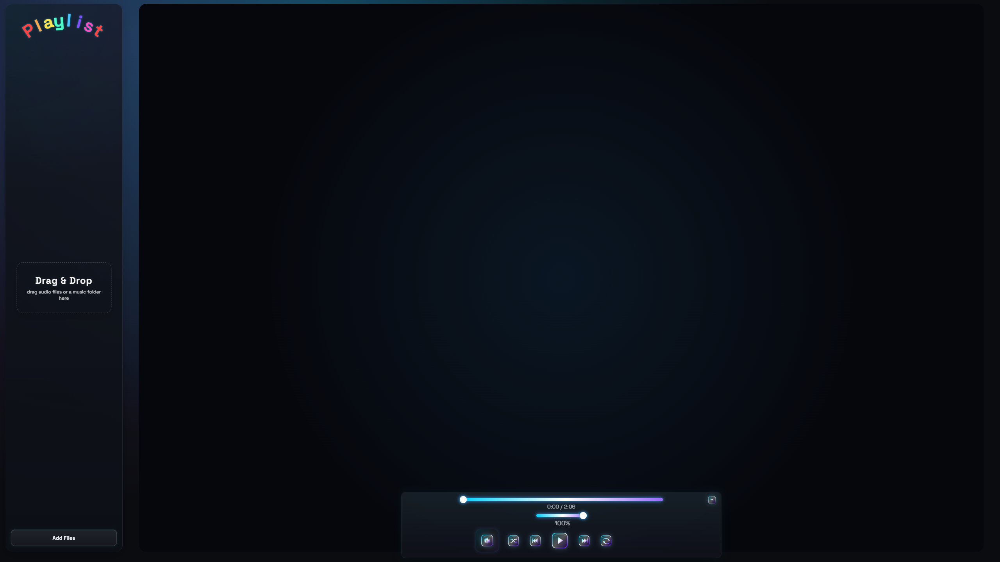
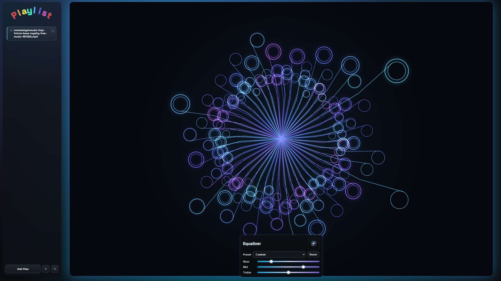
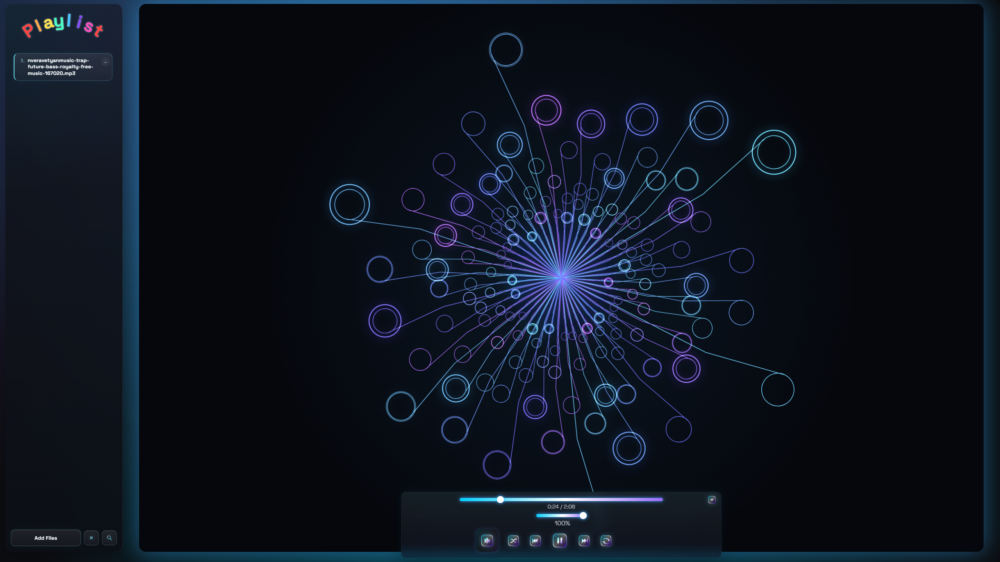
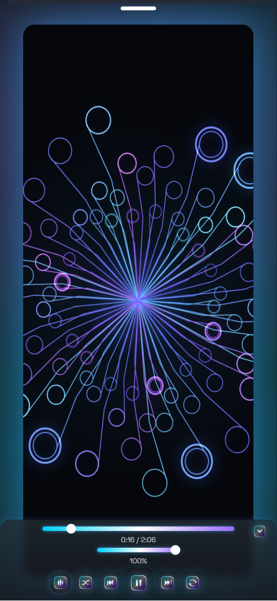

<p align="center">
  
</p>

---

## 🚀 Live Demo
- **Landing page:** https://nataliaans78-lang.github.io/EchoGlow/
- **Player demo:** https://nataliaans78-lang.github.io/EchoGlow/app/

---

## 🎬 Preview

<p align="center">
  
</p>

<p align="center">
  <a href="https://github.com/nataliaans78-lang/EchoGlow/releases/latest/download/hello_demo.mp4">
    ▶ Download Full MP4 Demo
  </a>
</p>

---

## 🖼️ Screenshots

<table>
  <tr>
    <td valign="top" width="50%">
      
    </td>
    <td valign="top" width="50%">
      
    </td>
  </tr>
  <tr>
    <td valign="top" width="50%">
      
    </td>
    <td valign="top" width="50%">
      
    </td>
  </tr>
</table>

---

## ✨ Features

- Drag & drop audio files **and folders**
- Real-time canvas visualizer with neon glow
- 3-band EQ (Bass / Mid / Treble) with presets
- Playlist search
- Shuffle / Repeat
- Playlist & player state persistence (IndexedDB + localStorage)
- Clear modal (`Clear Playlist` / `Reset App`)
- Toast feedback for autosave & storage limits
- Keyboard shortcuts (play/pause, next/prev, seek, volume)
- Mobile layout with slide-down playlist panel
- Service Worker (PWA-ready app shell)

---

## 🛠️ Tech Stack

- HTML / CSS / Vanilla JS
- Web Audio API (AudioContext + BiquadFilter + Analyser)
- IndexedDB + localStorage
- Service Worker (offline-ready shell)

---

## 📦 Release

Current version: **v1.0.0**

Initial public release including:
- Stable player build
- UI refinements
- Optimized MP4 demo preview

---

## ▶️ Run Locally

### Option A (quick)
Open `docs/app/index.html` in your browser.

### Option B (local server)

```bash
cd docs
python -m http.server 8000
