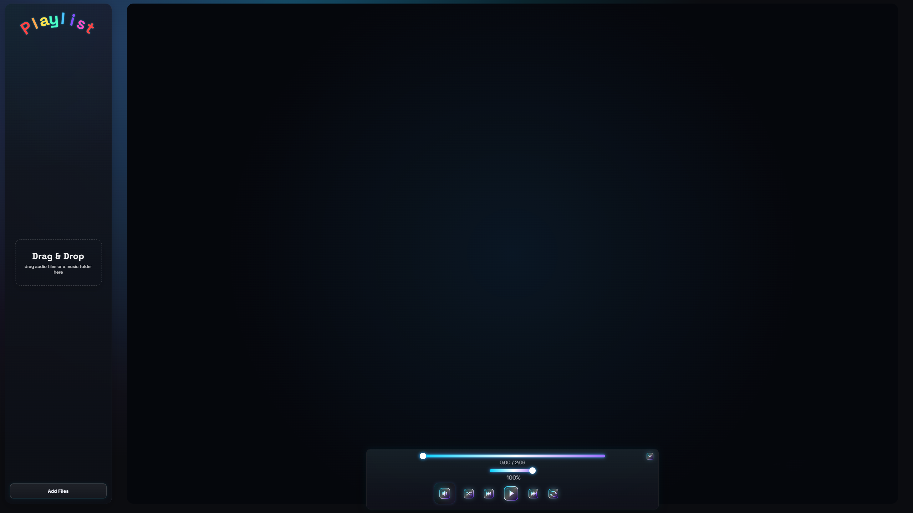
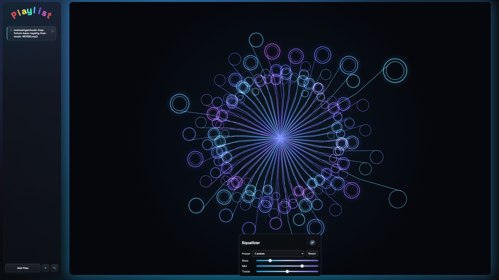
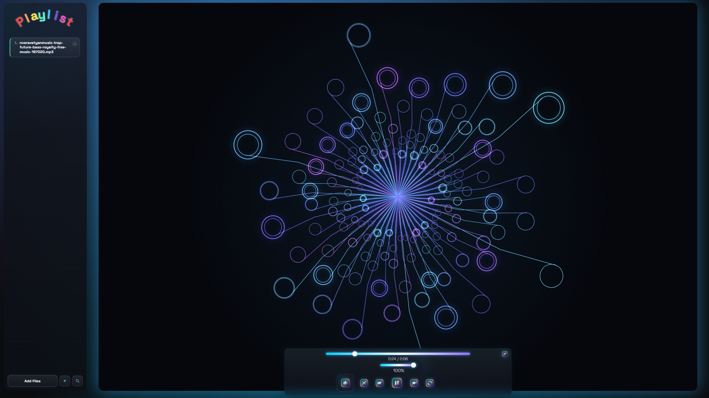
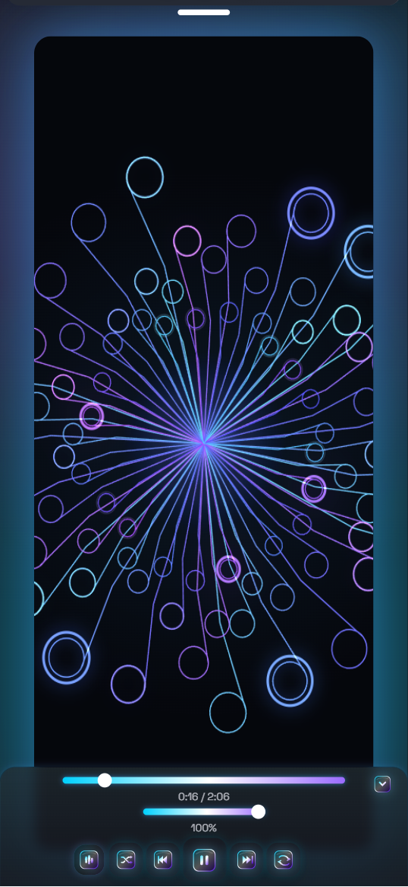

<p align="center">
  
</p>

---

## 🚀 Live Demo
- **Landing page:** https://nataliaans78-lang.github.io/EchoGlow/
- **Player demo:** https://nataliaans78-lang.github.io/EchoGlow/app/

---

## 🎬 Preview

<p align="center">
  <video
    src="docs/assets/video/EchoGlow.webm"
    width="60%"
    autoplay
    muted
    loop
    playsinline
    controls
  >
    Your browser does not support the video tag.
  </video>
</p>

<p align="center">
  <a href="https://github.com/nataliaans78-lang/EchoGlow/releases/latest/download/EchoGlow.mp4">
    ▶ Download Full MP4 Demo
  </a>
</p>

---

## 🖼️ Screenshots

<table>
  <tr>
    <td valign="top" width="50%">
      
    </td>
    <td valign="top" width="50%">
      
    </td>
  </tr>
  <tr>
    <td valign="top" width="50%">
      
    </td>
    <td valign="middle" width="50%" align="center">
      
    </td>
  </tr>
</table>

---

## ✨ Features

- Drag & drop audio files **and folders**
- Real-time canvas visualizer with neon glow
- 3-band EQ (Bass / Mid / Treble) with presets
- Playlist search
- Shuffle / Repeat
- Playlist & player state persistence (IndexedDB + localStorage)
- Clear modal (`Clear Playlist` / `Reset App`)
- Toast feedback for autosave & storage limits
- Keyboard shortcuts (play/pause, next/prev, seek, volume)
- Mobile layout with slide-down playlist panel
- Service Worker (PWA-ready app shell)

---

## 🛠️ Tech Stack

- HTML / CSS / Vanilla JS
- Web Audio API (AudioContext + BiquadFilter + Analyser)
- IndexedDB + localStorage
- Service Worker (offline-ready shell)

---

## 📦 Release

Current version: **v1.0.0**

Initial public release including:
- Stable player build
- UI refinements
- Optimized MP4 demo preview

---

## ▶️ Run Locally

Run it from a local server.

### Option A: Live Server

Open the `docs` folder with VS Code and start **Live Server**.

Landing page:

```text
/
```

App:

```text
/app/
```

### Option B: Python server

```bash
cd docs
python -m http.server 8000
```

Then open:

```text
http://localhost:8000/
```

or:

```text
http://localhost:8000/app/
```
